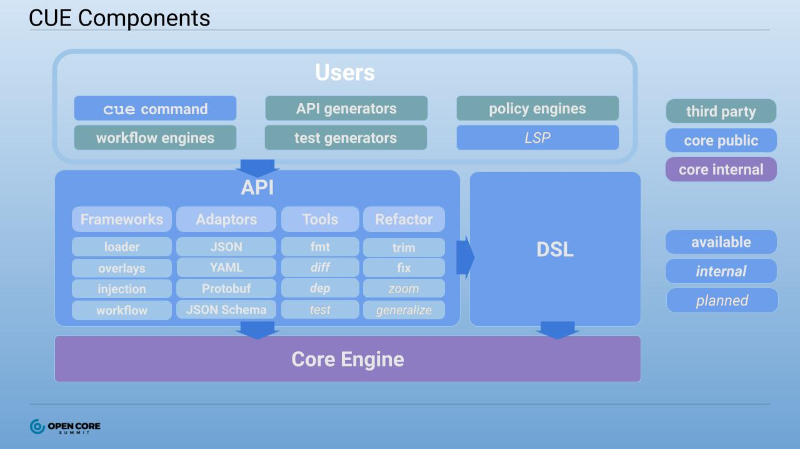

We see plenty of configuration languages, but surprisingly one has not become the one true language that is used everywhere. Why is that? One would think writing out data structures by hand would not be that hard. Why not configure everything in JSON and call it a day? If JSON does not provide enough abstraction to do the job, why not pick a general programming language like Python? Not for a lack of effort, the industry has failed to standardize on a solution that we are satisfied with and move on.

I developed an answer while writing [The Configuration Complexity Curse](https://blog.cedriccharly.com/post/20191109-the-configuration-complexity-curse/) for [CUE](https://cuelang.org/docs/about/). I wanted to know why a data configuration language (DCL) like CUE did not succeed much earlier. Until recently, most organizations did not need particularly complex configuration to do their work. Exceptions exist (CUE's design comes from computational linguistics, where a human language is defined as a massive configuration), but it is the rise of cloud computing that made managing complex configuration a widespread need. I framed CUE intentionally in terms of working with cloud tools like Kubernetes and Terraform because I recognized the general interest and appetite for better workflows for infrastructure configuration.

Success as a configuration language is more than copying a programming language grammar without the Turing completeness. Previous iterations restrict developers in an attempt to be principled without giving commesurate advantage in return. This new environment is a vacuum that a new language can fill. Now that almost all organizations must grapple with complex configuration, CUE is positioned to match the challenge and scale across the industry. Critically, CUE delivers while staying principled. Configuration should be non-Turing complete! Developing a language is a series of trade-offs. Powerful CUE features such as the query engine, simplified code generation/modification, and more are viable after disallowing recursion. A good trade for a safer language on top of all that.

In the long term, CUE wins by achieving **ubiquity**. A configuration language that is widely used and integrated is the key to overcoming the (inspired) [Configuration Complexity Clock](http://mikehadlow.blogspot.com/2012/05/configuration-complexity-clock.html). The clock describes the cycle of managing application configuration from hardcoded values morphing into a full blown Domain Specific Language (DSL) and finally back to hardcoded as the custom DSL becomes cumbersome. Although DSLs are better suited for configuration, it is the surrounding context like debugging, tooling, and libraries that is lacking and drives developers back to hardcoding so they have the benefit of a supported language. Again, building a language is *more than a syntax*. It is the workflows and integrations that make or break a language. In the future, CUE will be the new default because it best handles working in the domain of configuration data.

To be fair, building a language is no simple task. Building a ubiquitous language used by developers everywhere is an even heavier lift. But, CUE has the opportunity to be dominant because it is a configuration language. This is a key difference: if a programming languages are a classic network effect, configuration languages are a market.

## Configuration Is A Two-Sided Market

Programming languages benefit from network effects in multiple dimensions. The more users of the language, the more and better libraries, documentations, tutorials, etc. are available which attracts even more users. Once an organization has their core needs met (things like the development toolchain and core libraries) they are fairly independent. They can go off and do their own thing without caring what others do as long as they can build the desired software.

In contrast, configuration is not valued by itself. Configuration is closer to a contract or standard between users and software where the goal is to feed structured data to a program that does the useful work. Why does that matter? For a configuration language, success looks like making a market between users and tool developers. Each side wants access to the other as the reason to use a language like CUE:

- Users want to be able to use CUE (with its powerful features and tooling) across multiple workflows
- Tool makers want high demand for CUE to justify supporting a configuration language

The challenge is that we are stuck in a local maxima. Almost every tool uses configuration but it is not the differentiator, so most developers settle on using a language that is widely known and supported, like YAML. Writ large, it is the undifferentiated heavy lifting that underlies modern software development.

CUE will need to create a two sided market, which is harder than a network effect because each side has its own economies of scale and then matching those groups is a classic chicken-and-egg problem. A tall order. In return for overcoming this challenge, this barrier to entry becomes a powerful moat that would make CUE truly dominant for configuration. This is where configuration languages differ from programming languages. Even with network effects, there is plenty of specialization (such as garbage collected vs manual memory management) and independence for the industry to support multiple popular languages. There is less opportunity in configuration, where developers would not want to support multiple complex formats for a single tool or to learn multiple advanced configuration languages for largely the same kind of work.

The winning language will enjoy a power law where that language is the ubiquitous, default choice for configuration integration, libraries, and workflows. Other languages will exist, but would be relatively niche and limited without the same widespread support. The barrier becomes a moat.

## Chasing The Long Tail

The hardest part of making the market is that many different actors need to be brought in to kickstart the engine. Between CUE users and CUE tool makers, it is the tool makers that are more accessible for initial gains and rapid feedback. For one, tool makers are the much smaller group and hands-on help from the core CUE team goes much farther. Developers also acutely feel the pain building complex applications with anemic configuration options. Try building a modern compute management or continuous integration system and realize the your configuration options are YAML/JSON (maybe with a JSON schema if generous). At a certain point, the complexity of the problem space requires a more advanced configuration, and those developers would most benefit with the option to provide CUE integration.

Supporting the possible universe of integrations with tools (Terraform, Kubernetes) and adaptors to other standards (YAML, Protocol Buffers) is the long tail. It is certainly where much of the long term work for the language will happen, but it also the most powerful mechanism for CUE's growth. Large projects that adopt CUE effectively oboard their users to CUE.

CUE does have advantages managing all these integrations. As discussed earlier, configuration is not core to a application's implementation. Configuration lives at the margins as data before it is pulled in and used, which means that can be changed independently from the software. If a given tool takes in YAML/JSON as an input, because CUE can export as JSON with some automation a user can have a complete configuration workflow in CUE and the software does not have to be modified to work with the exported JSON. In this way CUE is *permissonless*, it is possible for a third party to provide CUE libraries without working on the project directly. We already see this with the community building libraries for working with Terraform, Cloudformation, Kubernetes, and various CI products. Once CUE package management lands, we will see many more libraries as sharing CUE code becomes much simpler.

## Capturing The Cloud

Although CUE has potential for all configuration use cases, initial focus should be on areas like cloud computing that have high potential for growing the userbase. Why cloud specifically? Cloud computing is still relatively new and is still growing massively, and declarative cloud configuration is even more recent. This presents an unique opportunity as an area with complex configuration needs that is in widespread demand. There are disciplines that use advanced configuration regularly, but something like computational linguistics is niche, while everyone needs to manage servers and databases.

Even with many projects tackling infrastructure management, there is space for CUE to be the default language of choice. The main reason is that configuration languages fit much better in the new paradigm of **Infrastructure as Data** (IaD). Kelsey Hightower contrasts IaD with Infrastructure as Code (IaC) [here](https://twitter.com/kelseyhightower/status/1164194470436302848) and [here](https://twitter.com/kelseyhightower/status/1338927903908630528). The driving point is that data is simpler to analyze, manipulate, serialize, and transport than code is. The goal then is finding the most effective way to model and manage data structures.

The answer of course is a configuration language, but it is not the better choice just because it is not Turing complete. Going back to the introduction, why not standardize on a language like Python as the default option for complex configuration? There are advantages. An established language has a large community, wide library support for different formats and protocols, as well as tooling like package managers and linters.

The main (and underappreciated) reason to back CUE is *opportunity cost*. It is taken for granted that a modern programming language will come with a complete, integrated toolchain, but the same expectations have yet to come for configuration languages. What makes this surprising is that CUE is even better positioned to provide advanced tooling then a programming language. As it turns out, in a CUE it is much easier to [generate and extract code](https://cuelang.org/docs/usecases/generate/) from other languages to CUE and [vice versa](https://cuelang.org/docs/integrations/). CUE as a language not only makes code generation easier, meta code analysis and modification simplify enough to be built in parts of the toolchain. Those kind of benefits show up in the [query engine](https://cuelang.org/docs/usecases/query/) and refactoring tools like `cue vet`, `cue trim`, and `cue fmt`. Are these capabilities possible with a language like Python? Some, but the restricted nature of CUE makes it much easier to implement in a restricted language, enough that advanced features and workflows can be supported first party by the core language team.

## Laying Layers

*Image from [Open Core Summit 2020 presentation](https://www.coss.community/cossc/ocs-2020-breakout-marcel-van-lohuizen-google-17i0)*

A high level view of the CUE components show how all these pieces come together. From the image above, the core engine and DSL is what is regularly thought as the language of CUE. But it is not that we are given a language and left to build out the rest. CUE also exposes key capabilities to convert from CUE to/from other formats as well as code generation and modification right in the API and `cue` command.
